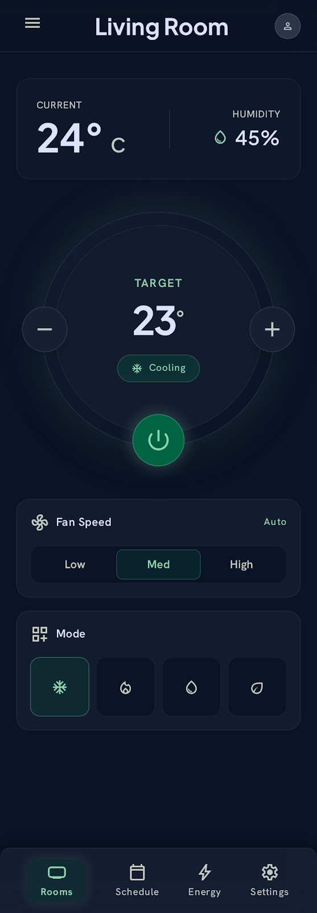

# Vora Climate Control

> Phase 2 Skill Task — Mobile Development Intern

A single-screen Flutter app for room climate control, built to match the Vora design system.


---

## What it does

- **Temperature dial** — tap +/− to step in 0.5° increments. The dial updates live.
- **Power toggle** — glowing button with animated on/off transitions.
- **Fan speed** — Low / Med / High segmented control, no dropdowns.
- **Mode selector** — Cool / Heat / Dry / Eco, each with its own color theme.
- **Sensor readings** — live display of current temperature and humidity.

---

## Stack

| Layer | Choice | Why |
|---|---|---|
| Framework | Flutter 3.x | Required by task spec |
| State | `provider` ^6.1 | Lightweight and evaluator-friendly |
| Design | Custom `VoraTheme` | Translated from DESIGN.md color tokens |

---

## Project structure

```
lib/
├── main.dart                  # entry point, Provider setup
├── models/
│   └── climate_state.dart     # pure data — no Flutter deps
├── providers/
│   └── climate_provider.dart  # ChangeNotifier, all state logic
├── screens/
│   └── home_screen.dart       # screen-level layout
├── widgets/
│   ├── stats_card.dart
│   ├── temp_dial.dart
│   ├── fan_speed_selector.dart
│   ├── mode_selector.dart
│   └── bottom_nav.dart
└── theme/
    └── app_theme.dart         # colors + typography from DESIGN.md
```

---

## Running it

You'll need Flutter 3.x and a connected device or emulator. Then:

```bash
git clone https://github.com/YOUR_USERNAME/vora-climate.git
cd vora-climate

# Install dependencies
flutter pub get

# Run on connected device/emulator
flutter run

# Optional release build
flutter build apk --release
```

---

## How state flows

All state lives in `ClimateProvider`. Widgets are pure render functions — they read from the provider and call methods on it. Nothing is stored locally in widget state.

```
ClimateProvider (source of truth)
    │
    ▼
Consumer<ClimateProvider>  ←── rebuilds on notifyListeners()
    │
    ├── StatsCard            reads currentTemp, humidity
    ├── TempDial             reads targetTemp, mode, isPoweredOn
    │                        calls provider.increaseTemp / decreaseTemp / togglePower
    ├── FanSpeedSelector     reads fanSpeed, calls provider.setFanSpeed
    └── ModeSelector         reads mode, calls provider.setMode
```

If a widget calls a method, it's on the provider. If it displays a value, it's reading from the provider. That's the whole model.
Disclamer: README.md made using AI
